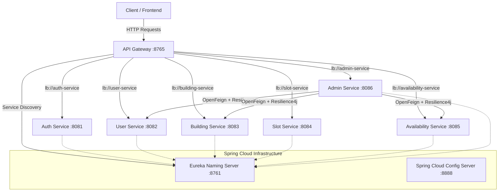

# Parking Slot Microservices

A Spring Boot and Spring Cloud based microservices system for managing parking slots, users, admins, buildings, and bookings.

---

## ⚙️ Tech Stack

- **Java**: 21 (LTS)
- **Framework**: Spring Boot 3.5.5 / Spring Cloud 2024.0.0
- **Service Discovery**: Netflix Eureka Server (`naming-server`)
- **API Gateway**: Spring Cloud Gateway (`api-gateway`)
- **Centralized Configuration**: Spring Cloud Config Server (`config-server`)
- **Inter-Service Communication**: Spring Cloud OpenFeign
- **Fault Tolerance & Resilience**: Resilience4j (Circuit Breaker, Retry, Fallback)
- **Observability & Tracing**: Spring Boot Actuator, Micrometer Tracing (Brave) & Zipkin
- **Security**: Spring Security 6 with JWT (JJWT 0.11.5)
- **Database / ORM**: PostgreSQL with Spring Data JPA & Hibernate
- **Build Tool**: Maven (Multi-Module Project)

---

## 🏗️ Architecture Overview

The system consists of **10 dedicated modules**:

```
parking-slot-microservices/
├── pom.xml                                   # Root Aggregator POM (packaging: pom)
│
├── naming-server/       (Port 8761)          # Netflix Eureka Service Registry & Discovery
├── config-server/       (Port 8888)          # Centralized Spring Cloud Config Server
├── api-gateway/         (Port 8765)          # Spring Cloud Gateway (Single Entry Point)
│
├── common-service/                           # Shared Library (JAR) - Models, DTOs, Security filters
│
├── auth-service/        (Port 8081)          # Authentication, Registration & JWT Issuance
├── user-service/        (Port 8082)          # User Profile Management & Administration
├── building-service/    (Port 8083)          # Building CRUD & Pincode/Name Lookup
├── slot-service/        (Port 8084)          # Parking Slot Operations & Floor/Division Allocation
├── availability-service/(Port 8085)          # Slot Availability & Booking / Cancellation
└── admin-service/       (Port 8086)          # Admin Overview, Dashboard & Feign Client Aggregator
```



---

## 📂 Module Descriptions

1. **`naming-server` (Port 8761)**: Eureka Service Registry. Microservices register dynamically; eliminates hardcoded hostnames and ports.
2. **`config-server` (Port 8888)**: Centralized configuration server managing environment profiles and externalized configuration.
3. **`api-gateway` (Port 8765)**: Single entry point for clients with intelligent routing, path rewrite, global logging filter, and CORS support.
4. **`common-service`**: Shared library containing DTOs, exception handlers, and security utilities.
5. **`auth-service` (Port 8081)**: User registration, authentication, and JWT token issuance.
6. **`user-service` (Port 8082)**: User profiles, role lookups, and account updates.
7. **`building-service` (Port 8083)**: Building management, address details, and pincode lookups.
8. **`slot-service` (Port 8084)**: Parking slot definitions, floor allocation, and division management.
9. **`availability-service` (Port 8085)**: Slot availability tracking and user booking operations.
10. **`admin-service` (Port 8086)**: Admin dashboard statistics aggregated via **OpenFeign** clients and protected with **Resilience4j** Circuit Breakers and Retries.

---

## 🚀 How to Run the Services

### 1. Build All Modules
```powershell
mvn clean install -DskipTests
```

### 2. Recommended Startup Order

#### Step A: Start Infrastructure
```powershell
# 1. Start Eureka Naming Server (Port 8761)
mvn spring-boot:run -pl naming-server

# 2. Start Centralized Config Server (Port 8888)
mvn spring-boot:run -pl config-server

# 3. Start API Gateway (Port 8765)
mvn spring-boot:run -pl api-gateway
```

#### Step B: Start Domain Microservices
```powershell
# Run auth-service (Port 8081)
mvn spring-boot:run -pl auth-service

# Run user-service (Port 8082)
mvn spring-boot:run -pl user-service

# Run building-service (Port 8083)
mvn spring-boot:run -pl building-service

# Run slot-service (Port 8084)
mvn spring-boot:run -pl slot-service

# Run availability-service (Port 8085)
mvn spring-boot:run -pl availability-service

# Run admin-service (Port 8086)
mvn spring-boot:run -pl admin-service
```

---

## 🌐 API Gateway Unified Routes (Port 8765)

Clients can access all microservices through the single entry point `http://localhost:8765`:

| Microservice | Gateway Route | Target Downstream URL |
| :--- | :--- | :--- |
| **Auth Service** | `http://localhost:8765/login`<br>`http://localhost:8765/register`<br>`http://localhost:8765/auth-service/**` | `lb://auth-service` |
| **User Service** | `http://localhost:8765/users/**`<br>`http://localhost:8765/user-service/**` | `lb://user-service` |
| **Building Service** | `http://localhost:8765/buildings/**`<br>`http://localhost:8765/building/**`<br>`http://localhost:8765/building-service/**` | `lb://building-service` |
| **Slot Service** | `http://localhost:8765/slots/**`<br>`http://localhost:8765/slot/**`<br>`http://localhost:8765/slot-service/**` | `lb://slot-service` |
| **Availability Service** | `http://localhost:8765/availability/**`<br>`http://localhost:8765/booking/**`<br>`http://localhost:8765/availability-service/**` | `lb://availability-service` |
| **Admin Service** | `http://localhost:8765/admin/**`<br>`http://localhost:8765/admin-service/**` | `lb://admin-service` |

---

## 📊 Dashboards & Health Check Endpoints

- **Eureka Service Registry Dashboard**: [http://localhost:8761/](http://localhost:8761/)
- **Gateway Actuator Health**: [http://localhost:8765/actuator/health](http://localhost:8765/actuator/health)
- **Admin Service Actuator Health**: [http://localhost:8086/actuator/health](http://localhost:8086/actuator/health)
- **Admin Dashboard Stats (OpenFeign + CircuitBreaker)**: `GET http://localhost:8086/admin/dashboard-stats`
