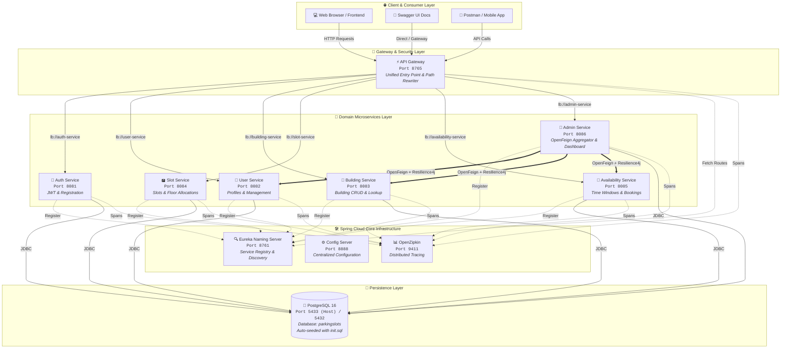

# 🚗 Parking Slot Microservices

An enterprise-grade, distributed microservices platform for managing parking slots, buildings, users, admins, and slot bookings built with **Spring Boot 3.5**, **Spring Cloud 2024**, **PostgreSQL**, and **OpenZipkin**.

---

## 🏗️ Architecture Overview

The system employs a decentralized microservices architecture orchestrated via **Netflix Eureka**, routed through a **Spring Cloud Gateway**, configured with **Spring Cloud Config Server**, monitored with **OpenZipkin**, and persisted in a containerized **PostgreSQL 16** database.



---

## ⚙️ Tech Stack & Key Technologies

| Technology | Purpose |
| :--- | :--- |
| **Java 21 (LTS)** | Core programming language |
| **Spring Boot 3.5.5** | Microservices application framework |
| **Spring Cloud 2024.0.0** | Cloud infrastructure, routing, configuration & discovery |
| **Spring Cloud Gateway** | Reactive, non-blocking single entry point with dynamic routing |
| **Netflix Eureka** | Dynamic service registry and health-checked service discovery |
| **Spring Cloud OpenFeign** | Declarative HTTP client for inter-service RPC communication |
| **Resilience4j** | Circuit breaker, retry mechanisms, and fallback tolerance |
| **Micrometer & Zipkin** | Distributed tracing and observability across asynchronous boundaries |
| **Spring Security 6 & JJWT** | Stateless authentication using JSON Web Tokens (JWT) |
| **Spring Data JPA & Hibernate** | Relational mapping, schema generation, and query execution |
| **PostgreSQL 16** | Relational database engine with persistent Docker volume |
| **SpringDoc OpenAPI 3** | Automated Swagger UI interactive documentation on all services |
| **Docker & Docker Compose** | Containerization, network bridging, and 1-click orchestration |

---

## 📂 Detailed Service Catalog

Each microservice is self-contained with its own lifecycle, port allocation, and interactive API documentation.

### 1. PostgreSQL Database (`postgres`)
- **Definition**: Containerized relational database engine storing all entities including users, buildings, slots, and bookings. Runs with a persistent named volume and executes `init.sql` automatically on first launch.
- **Port**: Host `5433` ➔ Container `5432`
- **Docker Command**: `docker compose up -d postgres`
- **Swagger URL**: *N/A (Database Engine)*
- **Dashboard / Connection**: Connect via any SQL client: `psql -h localhost -p 5433 -U postgres -d parkingslots` (Password: `postgres`)

---

### 2. OpenZipkin Tracing Server (`zipkin`)
- **Definition**: Distributed tracing backend and visualization UI collecting latency data and trace spans across all microservices. Enables distributed performance tracking and bottleneck analysis.
- **Port**: `9411`
- **Docker Command**: `docker compose up -d zipkin`
- **Swagger URL**: *N/A (Observability Tool)*
- **Dashboard URL**: [http://localhost:9411/zipkin/](http://localhost:9411/zipkin/)

---

### 3. Eureka Naming Server (`naming-server`)
- **Definition**: Central service registry where all microservices publish their instances and heartbeats. Enables client-side load balancing (`lb://`) without hardcoding hostnames or IP addresses.
- **Port**: `8761`
- **Run (Maven)**: `mvn spring-boot:run -pl naming-server`
- **Run (Docker)**: `docker compose up -d naming-server`
- **Swagger URL**: *N/A (Infrastructure Registry)*
- **Dashboard URL**: [http://localhost:8761/](http://localhost:8761/)

---

### 4. Centralized Config Server (`config-server`)
- **Definition**: Centralized configuration management server providing environment-specific properties to client services. Decouples application configuration from source code and deployment containers.
- **Port**: `8888`
- **Run (Maven)**: `mvn spring-boot:run -pl config-server`
- **Run (Docker)**: `docker compose up -d config-server`
- **Swagger URL**: *N/A (Infrastructure Service)*
- **Dashboard / Properties URL**: [http://localhost:8888/user-service/default](http://localhost:8888/user-service/default)

---

### 5. API Gateway (`api-gateway`)
- **Definition**: Single reverse proxy entry point that authenticates, logs, and forwards incoming HTTP requests to downstream microservices. Performs path stripping, CORS header injection, and distributed trace propagation.
- **Port**: `8765`
- **Run (Maven)**: `mvn spring-boot:run -pl api-gateway`
- **Run (Docker)**: `docker compose up -d api-gateway`
- **Swagger UI**: [http://localhost:8765/swagger-ui.html](http://localhost:8765/swagger-ui.html) *(Aggregates all microservice APIs with interactive definition dropdown)*
- **OpenAPI JSON**: [http://localhost:8765/v3/api-docs](http://localhost:8765/v3/api-docs)
- **Dashboard / Actuator URL**:
  - Health: [http://localhost:8765/actuator/health](http://localhost:8765/actuator/health)
  - Routes: [http://localhost:8765/actuator/gateway/routes](http://localhost:8765/actuator/gateway/routes)

---

### 6. Common Library (`common-service`)
- **Definition**: Shared library module packaged as a standard JAR dependency across all domain microservices. Contains common entities, DTOs, custom exception handlers, and centralized Swagger `OpenAPIConfig`.
- **Packaging**: `mvn clean install -pl common-service`
- **Port / Run / Swagger**: *N/A (Shared Java Library JAR)*

---

### 7. Auth Service (`auth-service`)
- **Definition**: Handles user registration, credentials verification, and JWT token issuance for authentication. Serves as the security gatekeeper generating cryptographically signed claims for downstream authorization.
- **Port**: `8081`
- **Run (Maven)**: `mvn spring-boot:run -pl auth-service`
- **Run (Docker)**: `docker compose up -d auth-service`
- **Swagger UI**: [http://localhost:8081/swagger-ui/index.html](http://localhost:8081/swagger-ui/index.html)
- **OpenAPI JSON**: [http://localhost:8081/v3/api-docs](http://localhost:8081/v3/api-docs)
- **Actuator Health**: [http://localhost:8081/actuator/health](http://localhost:8081/actuator/health)

---

### 8. User Service (`user-service`)
- **Definition**: Manages user profiles, role assignments (ADMIN/USER), user detail updates, and user count statistics. Persists user accounts and exposes endpoints consumed by the admin aggregator.
- **Port**: `8082`
- **Run (Maven)**: `mvn spring-boot:run -pl user-service`
- **Run (Docker)**: `docker compose up -d user-service`
- **Swagger UI**: [http://localhost:8082/swagger-ui/index.html](http://localhost:8082/swagger-ui/index.html)
- **OpenAPI JSON**: [http://localhost:8082/v3/api-docs](http://localhost:8082/v3/api-docs)
- **Actuator Health**: [http://localhost:8082/actuator/health](http://localhost:8082/actuator/health)

---

### 9. Building Service (`building-service`)
- **Definition**: Responsible for building metadata, address info, postal pincode queries, and building ownership by users. Supports searching buildings by city/name and calculates total building counts.
- **Port**: `8083`
- **Run (Maven)**: `mvn spring-boot:run -pl building-service`
- **Run (Docker)**: `docker compose up -d building-service`
- **Swagger UI**: [http://localhost:8083/swagger-ui/index.html](http://localhost:8083/swagger-ui/index.html)
- **OpenAPI JSON**: [http://localhost:8083/v3/api-docs](http://localhost:8083/v3/api-docs)
- **Actuator Health**: [http://localhost:8083/actuator/health](http://localhost:8083/actuator/health)

---

### 10. Slot Service (`slot-service`)
- **Definition**: Defines physical and logical parking slots associated with buildings, floor levels, and division numbers. Allocates unique slot identifiers and coordinates slot availability links.
- **Port**: `8084`
- **Run (Maven)**: `mvn spring-boot:run -pl slot-service`
- **Run (Docker)**: `docker compose up -d slot-service`
- **Swagger UI**: [http://localhost:8084/swagger-ui/index.html](http://localhost:8084/swagger-ui/index.html)
- **OpenAPI JSON**: [http://localhost:8084/v3/api-docs](http://localhost:8084/v3/api-docs)
- **Actuator Health**: [http://localhost:8084/actuator/health](http://localhost:8084/actuator/health)

---

### 11. Availability Service (`availability-service`)
- **Definition**: Tracks time-based parking slot availability schedules and handles slot reservation bookings and cancellations. Provides booking status updates and total reservation counters.
- **Port**: `8085`
- **Run (Maven)**: `mvn spring-boot:run -pl availability-service`
- **Run (Docker)**: `docker compose up -d availability-service`
- **Swagger UI**: [http://localhost:8085/swagger-ui/index.html](http://localhost:8085/swagger-ui/index.html)
- **OpenAPI JSON**: [http://localhost:8085/v3/api-docs](http://localhost:8085/v3/api-docs)
- **Actuator Health**: [http://localhost:8085/actuator/health](http://localhost:8085/actuator/health)

---

### 12. Admin Service (`admin-service`)
- **Definition**: High-level administrative aggregator that queries user, building, and booking counts via Spring Cloud OpenFeign. Protected with Resilience4j circuit breakers to guarantee dashboard availability even during partial outages.
- **Port**: `8086`
- **Run (Maven)**: `mvn spring-boot:run -pl admin-service`
- **Run (Docker)**: `docker compose up -d admin-service`
- **Swagger UI**: [http://localhost:8086/swagger-ui/index.html](http://localhost:8086/swagger-ui/index.html)
- **OpenAPI JSON**: [http://localhost:8086/v3/api-docs](http://localhost:8086/v3/api-docs)
- **Admin Dashboard API**: `GET http://localhost:8086/admin/dashboard` *(Requires Bearer JWT)*
- **Actuator Health**: [http://localhost:8086/actuator/health](http://localhost:8086/actuator/health)

---

## 🐳 Docker Operations & Complete Lifecycle

### 1. Build Multi-Module Application JARs
Before packaging Docker images, compile and generate the executable JAR files:
```bash
mvn clean package -DskipTests
```

### 2. Start All Containers (1-Click Deployment)
Build all Docker images and launch the entire microservice stack in detached background mode:
```bash
docker compose up --build -d
```

### 3. Check Container Health and Status
Verify that all 11 services are running and healthy:
```bash
docker compose ps
```

### 4. Stream Logs
```bash
# Follow logs across ALL services simultaneously
docker compose logs -f

# Follow logs for a specific service
docker compose logs -f api-gateway
docker compose logs -f user-service
docker compose logs -f postgres
```

### 5. Restart Services
```bash
# Restart the entire stack
docker compose restart

# Restart a specific service
docker compose restart user-service
```

### 6. Stop All Containers
```bash
# Stop containers while preserving database volume
docker compose down

# Stop containers AND wipe out all volume data (fresh start)
docker compose down -v
```

---

## 🖥️ Standalone Local Development (Running without Docker)

If you prefer to run services individually on your local JVM:

### Step 1: Start Infrastructure First
```bash
# 1. Start Eureka Naming Server
mvn spring-boot:run -pl naming-server

# 2. Start Config Server
mvn spring-boot:run -pl config-server

# 3. Start API Gateway
mvn spring-boot:run -pl api-gateway
```

### Step 2: Start Domain Microservices
```bash
# In separate terminal tabs:
mvn spring-boot:run -pl auth-service
mvn spring-boot:run -pl user-service
mvn spring-boot:run -pl building-service
mvn spring-boot:run -pl slot-service
mvn spring-boot:run -pl availability-service
mvn spring-boot:run -pl admin-service
```

---

## 💾 Database Schema & Pre-Seeded Sample Data

The project includes an automatic initialization script [init.sql](file:///home/venkatesh/Desktop/parking-slot-microservices/init.sql) mounted to `/docker-entrypoint-initdb.d/init.sql`.

When running `docker compose up` for the first time, PostgreSQL automatically sets up the tables and inserts 3 interrelated sample records:

### 🔑 Default Credentials

| Role | Email | Password | Assigned Permissions / Resources |
| :--- | :--- | :--- | :--- |
| **ADMIN** | `admin@parking.com` | `admin123` | Full access to Admin Dashboard, Buildings (`Cyber Towers`, `Prestige Tech Park`) |
| **USER** | `john.doe@example.com` | `user123` | Standard user, Booked Slot `A-101` in Building 1 |
| **USER** | `alice.smith@example.com` | `user123` | Standard user, Confirmed Slot `A-102` in Building 1 |

### 🛠️ Manual Database Execution (If Needed)
To re-seed or run queries manually against the containerized database:
```bash
# Inside Docker container
docker exec -i parking-postgres psql -U postgres -d parkingslots < init.sql

# From host via port 5433
PGPASSWORD=postgres psql -h localhost -p 5433 -U postgres -d parkingslots -f init.sql
```

---

## 🌐 API Gateway Unified Routes (`Port 8765`)

Clients access downstream microservices through the API Gateway without needing to know individual ports:

| Microservice | Gateway Public URL Pattern | Target Downstream Route |
| :--- | :--- | :--- |
| **Auth Service** | `POST http://localhost:8765/login`<br>`POST http://localhost:8765/register`<br>`http://localhost:8765/auth-service/**` | `lb://auth-service` |
| **User Service** | `http://localhost:8765/users/**`<br>`http://localhost:8765/user-service/**` | `lb://user-service` |
| **Building Service** | `http://localhost:8765/buildings/**`<br>`http://localhost:8765/building/**`<br>`http://localhost:8765/building-service/**` | `lb://building-service` |
| **Slot Service** | `http://localhost:8765/slots/**`<br>`http://localhost:8765/slot/**`<br>`http://localhost:8765/slot-service/**` | `lb://slot-service` |
| **Availability Service** | `http://localhost:8765/availability/**`<br>`http://localhost:8765/booking/**`<br>`http://localhost:8765/availability-service/**` | `lb://availability-service` |
| **Admin Service** | `http://localhost:8765/admin/**`<br>`http://localhost:8765/admin-service/**` | `lb://admin-service` |

---

## 🔐 How to Test with JWT Authentication in Swagger UI

All microservices implement centralized Bearer Token security via [OpenAPIConfig.java](file:///home/venkatesh/Desktop/parking-slot-microservices/common-service/src/main/java/com/parking/common/config/OpenAPIConfig.java):

1. **Get JWT Token**:
   - Open [Auth Service Swagger](http://localhost:8081/swagger-ui/index.html) or run:
     ```bash
     curl -X POST http://localhost:8081/login \
       -H "Content-Type: application/json" \
       -d '{"email":"admin@parking.com","password":"admin123"}'
     ```
   - Copy the `jwt` token string from the JSON response.

2. **Authorize in Swagger**:
   - Open Swagger UI for any service (e.g., [Admin Service Swagger](http://localhost:8086/swagger-ui/index.html)).
   - Click the green **Authorize 🔓** button in the upper right.
   - Paste the JWT token directly into the input field and click **Authorize**.

3. **Execute API**:
   - Test endpoints like `GET /admin/dashboard`. Swagger automatically sends `Authorization: Bearer <token>`.
